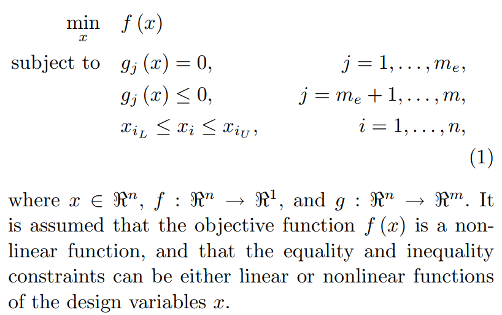

# LinacOpt

Jun Zhu

---

## Introduction

An object-oriented Python API for beam dynamics optimization with ASTRA and IMPACT-T.



## Dependencies

- Python2 > 2.7.6
- NumPy, Pandas, Scipy, matplotlib(only for visualization)
- psutil
- [pyOpt](http://www.pyopt.org/)
- [ASTRA](http://www.desy.de/~mpyflo/)
- [IMPACT-T](http://portal.nersc.gov/project/m669/IMPACT-T/)

## Installation

- Download LinacOpt
```
  git clone http://github.com/zhujun98/LinacOpt.git
```

### Windows
- Download and install [Anaconda Python](https://www.continuum.io/downloads).
- Install - [pyOpt](http://www.pyopt.org/)
- Set your system environment
```
  export PYTHONPATH=your/path/for/LinacOpt/
```

### MacOS

### Linux

- Install [pyOpt](http://www.pyopt.org/)

Replace the default `pyopt/pyOpt/pyALPSO/alpso.py` with the new one (optional). The new file will let you know why the optimization converges and print out the value of the augmented Lagrangian term.

## Optimizers

### Global optimizers: 

#### [Augmented Lagrangian Particle Swarm Optimizer](http://www.pyopt.org/reference/optimizers.alpso.html#module-pyALPSO)

- Convergence condition:

```
if (abs(global_distance[0]-global_distance[stopIters-1]) <= \
    dtol*abs(global_distance[stopIters-1]) and \
    abs(global_L[0]-global_L[stopIters-1]) <= \
    rtol*abs(global_L[stopIters-1]) or \
    abs(global_L[0]-global_L[stopIters-1]) <= atol):
    stop_criteria_flag = 1
```

- If the objective is a small number, one must change 'atol' otherwise the optimization will stop prematurely.

- 'dynInnerIter' must be set to 1 in order to make minInnerIter take effect!

#### [Non Sorting Genetic Algorithm II](http://www.pyopt.org/reference/optimizers.nsga2.html#module-pyNSGA2)

### Local search optimizers:

#### [SDPEN](http://www.pyopt.org/reference/optimizers.sdpen.html#module-pySDPEN)


## Common problems and tips

- Do not use very deep directory to run the simulation. Otherwise the name of the output file may be truncated! (This seems to be a problem with FORTRAN).

- Be careful about the number of grids (e.g. nrad and nlong_in in ASTRA)!!! For example, when you are optimizing the emittance of a gun, the optimizer may go over the working point with a very small laser spot size. If the number of grids is too small, it may underestimate the space-charge effects. However, the thermal emittance decreases as the laser spot size decreases. Therefore, if you do not have enough grids, you may get the wrong result in this case. My experience is that the longitudinal grid number is more important.

- The parallel version of ASTRA will be stuck at some crazy working points where a lot of particles are lost. I set a 'time_out' parameter which will kill the simulation after a certain time (the optimization will continue). The default value of 'time_out' is 1200 s.


